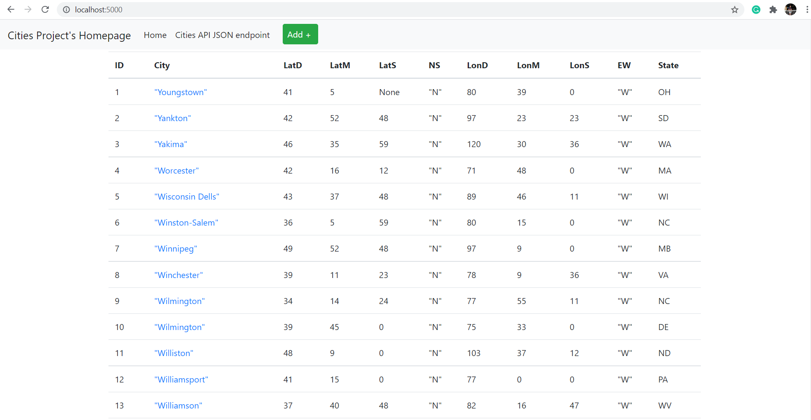
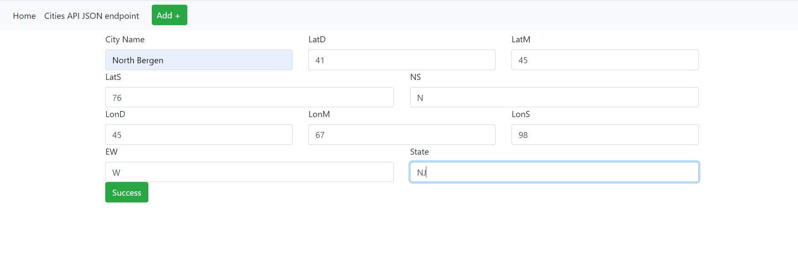
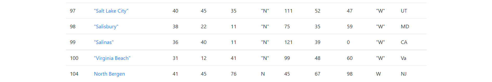
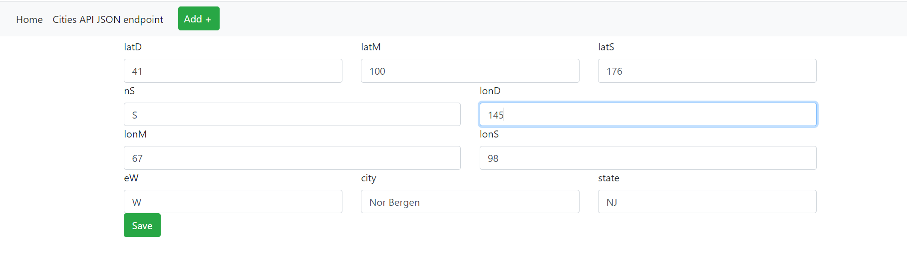
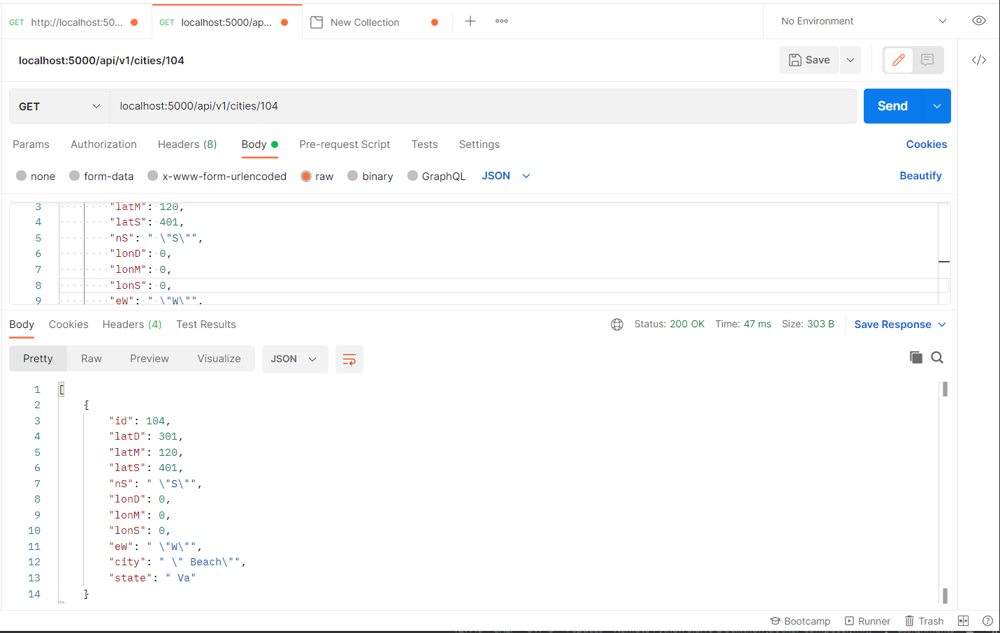
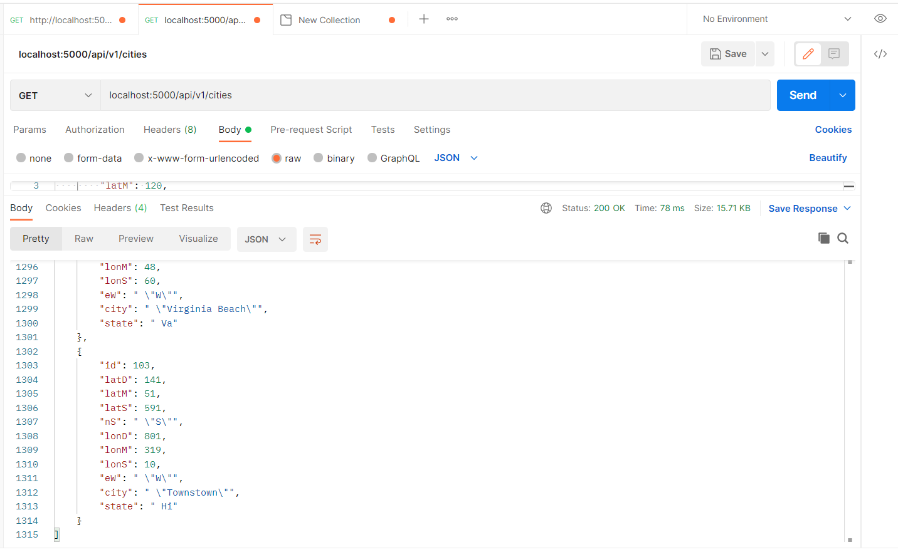

# Project Description
This project is a homework assignment to teach how to get Pycharm setup with Docker, Flask, MySQL, and Postman

[Download Assignment PDF Here](PPFSQL-Homework.pdf)

[View Assignment Video Here](https://youtu.be/QbMWNgrfAFg)

# Readings
* [What is an HTTP API?](https://www.smashingmagazine.com/2018/01/understanding-using-rest-api/)
* [What is JSON?](https://www.w3schools.com/whatis/whatis_json.asp)
* [What is SQL?](http://www.sqlcourse.com/intro.html)
* [What is MySQL](https://www.hostinger.com/tutorials/what-is-mysql)
* [What is Docker Compose?](https://www.tutorialspoint.com/docker/docker_compose.htm)
* [What is Flask?](https://en.wikipedia.org/wiki/Flask_(web_framework))
# Useful Links
* [Flask Homepage and Documentation](https://flask.palletsprojects.com/en/1.1.x/)
* [JSON Spec Reference](https://www.json.org/json-en.html)
* [SimpleJSON Reference](https://simplejson.readthedocs.io/en/latest/)
* [W3 Schools SQL Tutorial and Reference](https://www.w3schools.com/sql/)

# SQL Data Table Screenshot

# Home Page Screenshot

# View Data

# New Data Screenshot

# Edit Data Screenshot

# Delete Data Screenshot

